## Vue 基础学习

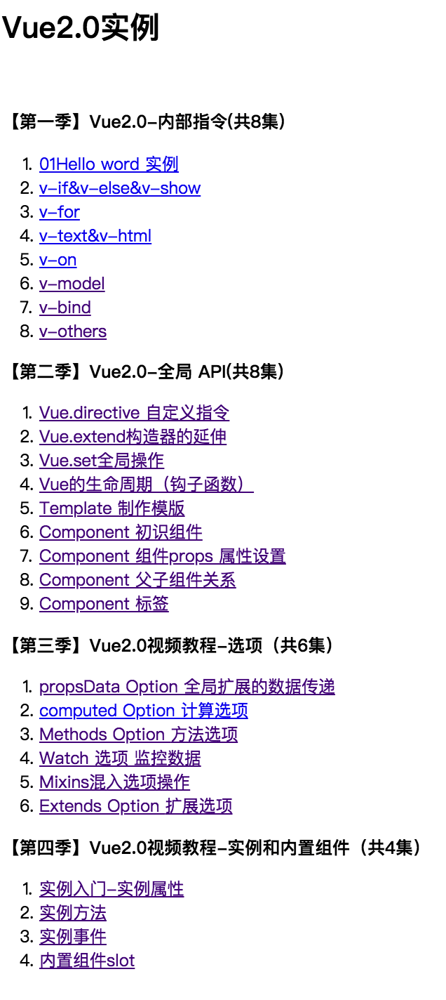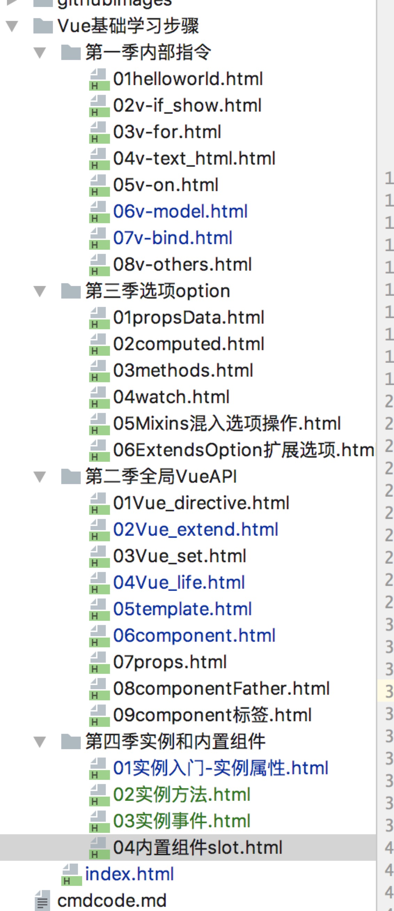

## Vue 全家桶

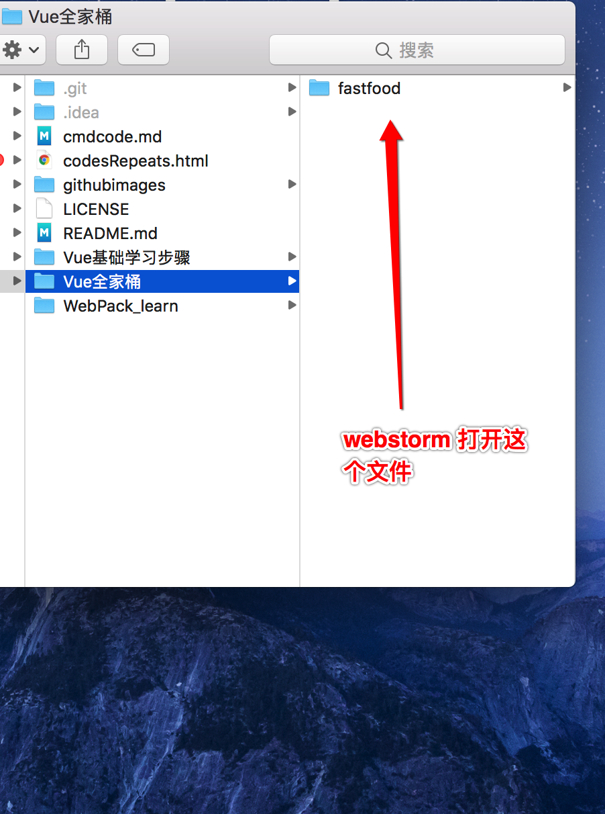|
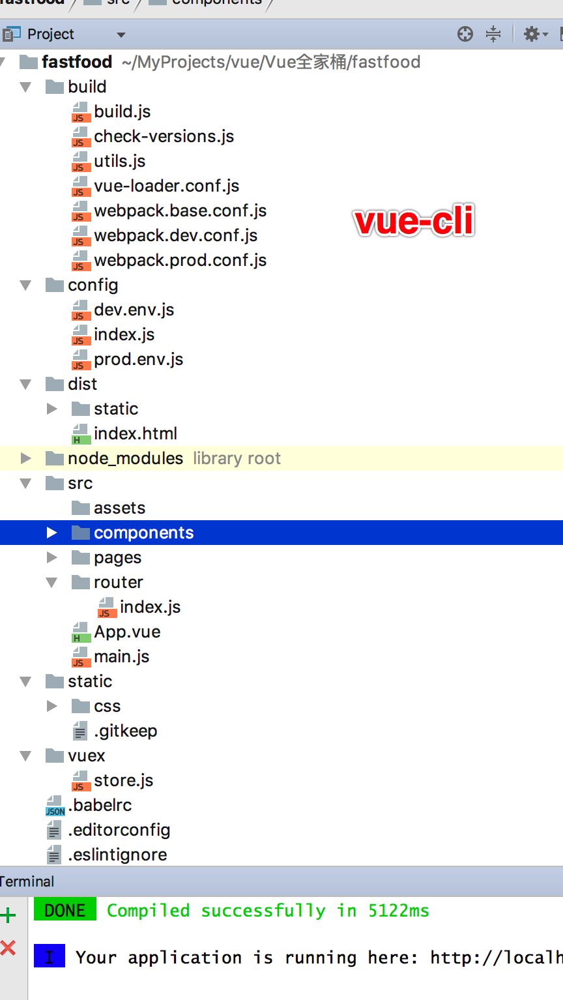|
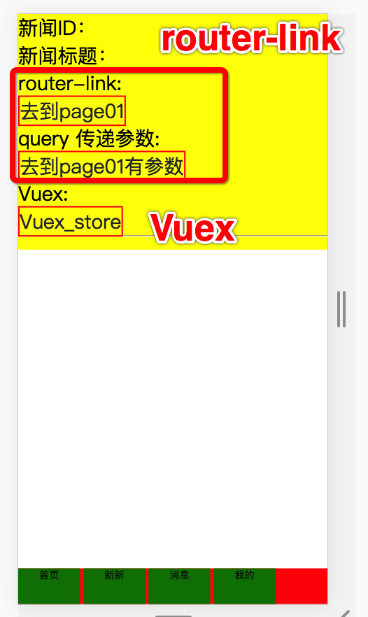|
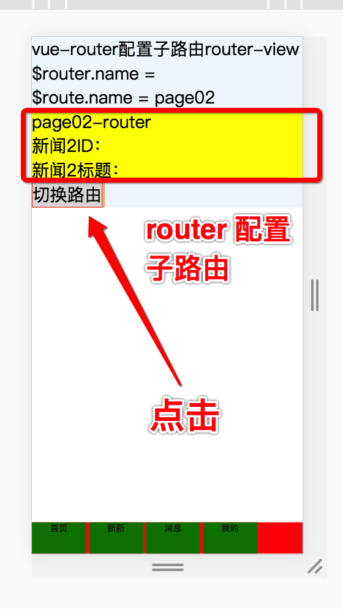|
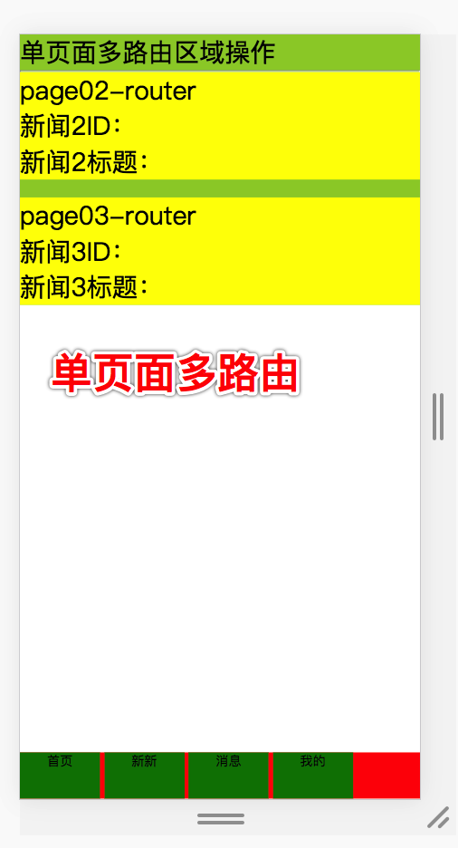|
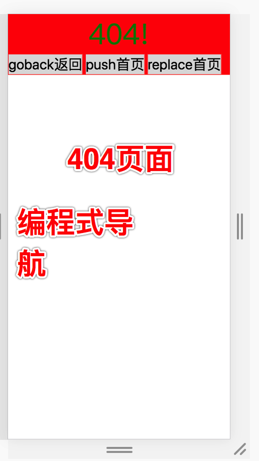

## Vue 实战 + webpack注释

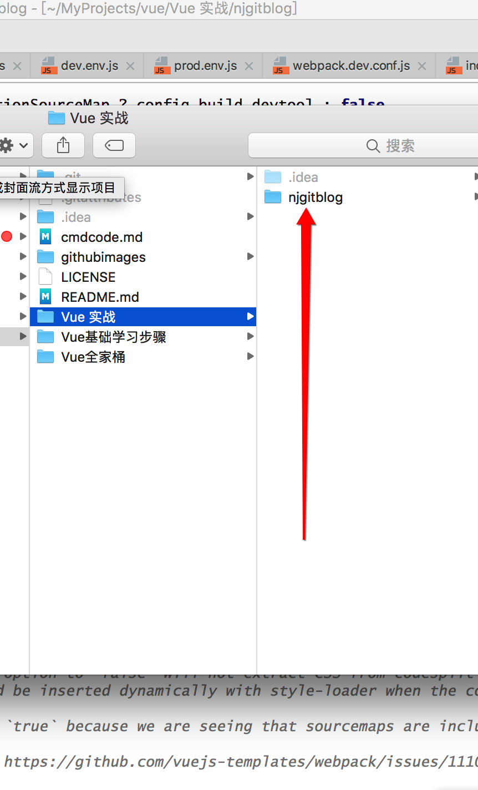|
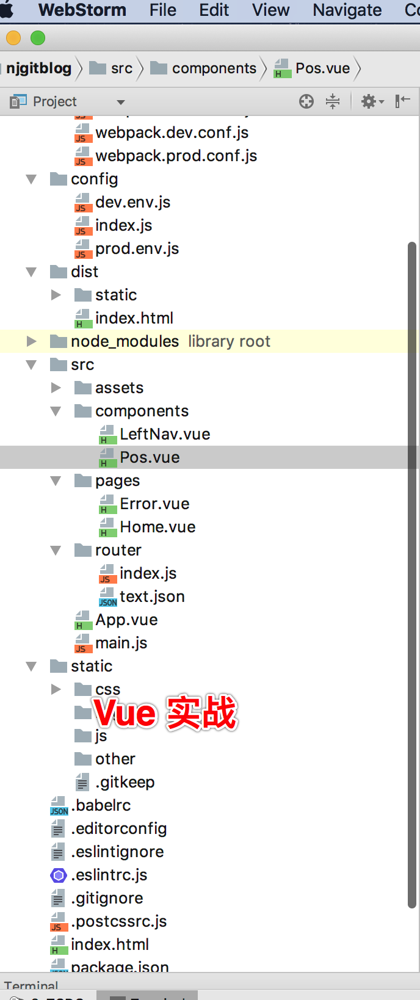|
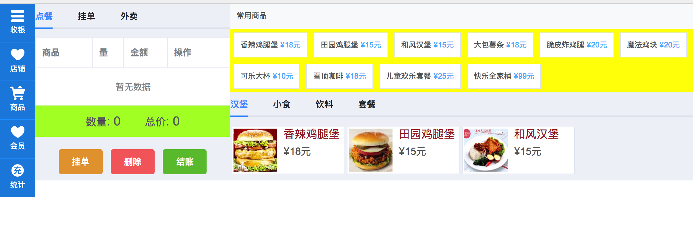

## Weex

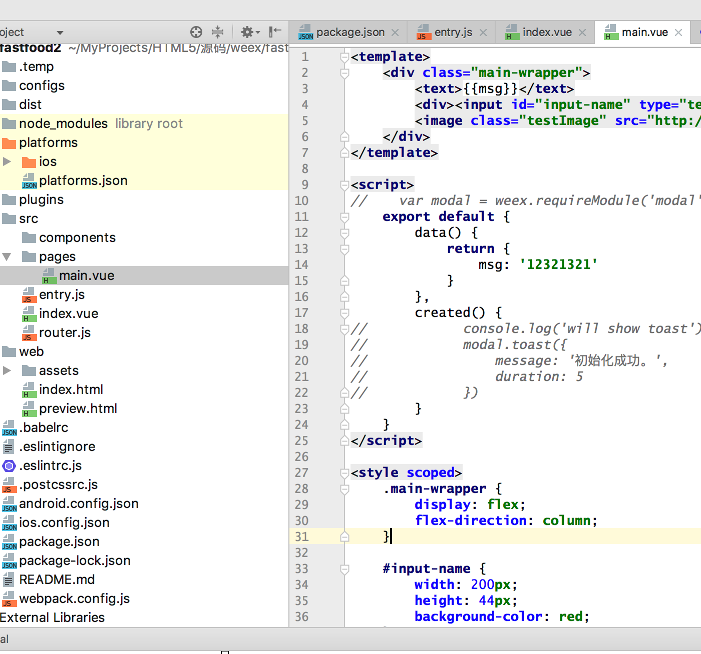|

## 前端开发环境搭建

教程中我们采用前后端分离的开发模式，也就是前端调用后端提供的JSON接口，让Vue和Koa2的代码没有任何的耦合。所以开发环境也是完全分离的，开发完成后你甚至可以分别部署到两个服务器上来进行运行。

1.建立前端文件夹

我在D盘的Code目录下建立了SmileVue文件夹。smile是微笑的意思，使用这个单词，我需要大家在学习完这套教程都对整个项目的理解和技术上的应用有一个层次的提供，露出微笑的表情。

你也可以利用终端的形式建立，打开终端进入D盘的code目录下，建立命令如下：

mkdir SmileVue

当然这个目录可以和我的不一样，你可以起一个自己喜欢的名字，也可以找一个自己喜欢的盘符位置。

目录建立好以后，打开代码编辑工具Visual Studio Code(以后简称VSCode)。并在VSCode中打开我们的项目。

2.使用vue-cli生成项目目录
使用vue-cli非常方便快速，它可以为我们生成基本的Vue的项目结构。

检测npm版本，在终端输入 npm -v,尽量使用5.x以上版本。
全局安装vue-cli，在终端里输入，npm install vue-cli -g。
在终端中输入 vue init webpack
等到上面这些都正确安装完成后，我们需要验证一下，我们安装是否成功。

3.测试环境是否安装成功

使用npm run dev 进行测试环境的打开。
在浏览器中输入 http://localhost:8080 进行测试。
在浏览器中打开页面，出现Vue的正常页面时，说明你的项目已经初始化成功了。下节课我们就可以愉快的进行编程了。

一个README.md的重要性
在一个实际项目中,特别是开源项目中是非常重要的。
所以我们要建立一个README.md文件，这个就是你项目的说明文件。
每个公司的书写要求有所不同，所以请根据实际情况编写。
我这里就记录每节课的讲述内容和项目的初始化方法了。
