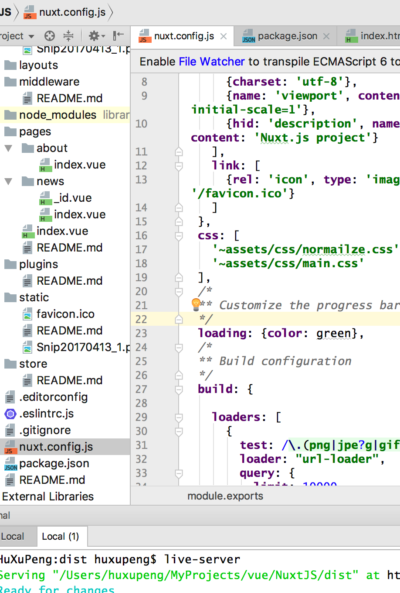

[**感谢技术胖: 大家可以前往 看详细Vue文档和视频**](http://jspang.com/2018/01/21/vue-timeline/)

## 所需要的知识
- HTML的基础知识，你需要达到中级水平，写前端页面的结构代码完全没有问题。

- CSS的基础知识，最好做过半年以上的切图和布局，最好了解CSS3的知识。

- Javascript的基础知识，对基本语法掌握，这个要求不高，因为遇到难的我会在视频中讲解。

- node.js初级知识，只需要会npm的使用和项目初始化就可以了

## VUE学习路线, 让你不迷路, 请按此顺序学习。
- Vue 的基础学习步骤
	- [【第一季】Vue2.0视频教程-内部指令(共8集)](http://jspang.com/2017/02/23/vue2_01/)
	- [【第二季】Vue2.0视频教程-全局API(共9集)](http://jspang.com/2017/03/14/vue2_02/)
	- [【第三季】Vue2.0视频教程-选项（共6集）](http://jspang.com/2017/03/26/vue3/)
	- [【第四季】Vue2.0视频教程-实例和内置组件（共4集）](http://jspang.com/2017/04/09/vue2_4/)

- Vue全家桶
	- [Vue-cli 视频教程](http://jspang.com/2017/04/10/vue-cli/)
	- [Vue-router视频教程](http://jspang.com/2017/04/13/vue-router/)
	- [Vuex视频教程](http://jspang.com/2017/05/03/vuex/)

- Vue 实战
	- [Vue实战视频-快餐店收银系统](http://jspang.com/2017/05/22/vuedemo/)

- Webpack
	- [Webpack3.X版 成神之路](http://jspang.com/2017/09/16/webpack3-2/) 

- Weex
	- [WEEX免费视频教程-从入门到放肆](http://jspang.com/2017/07/12/weex/)

- Nuxt.js
	- [Nuxt.js免费视频教程 开启SSR渲染](http://jspang.com/2018/02/26/nuxt/) 

## Vue 基础学习

## Vue 全家桶

|
|
|
|
|

## Vue 实战 + webpack注释

|
|

## Weex

|

## Nuxt.js 

|

